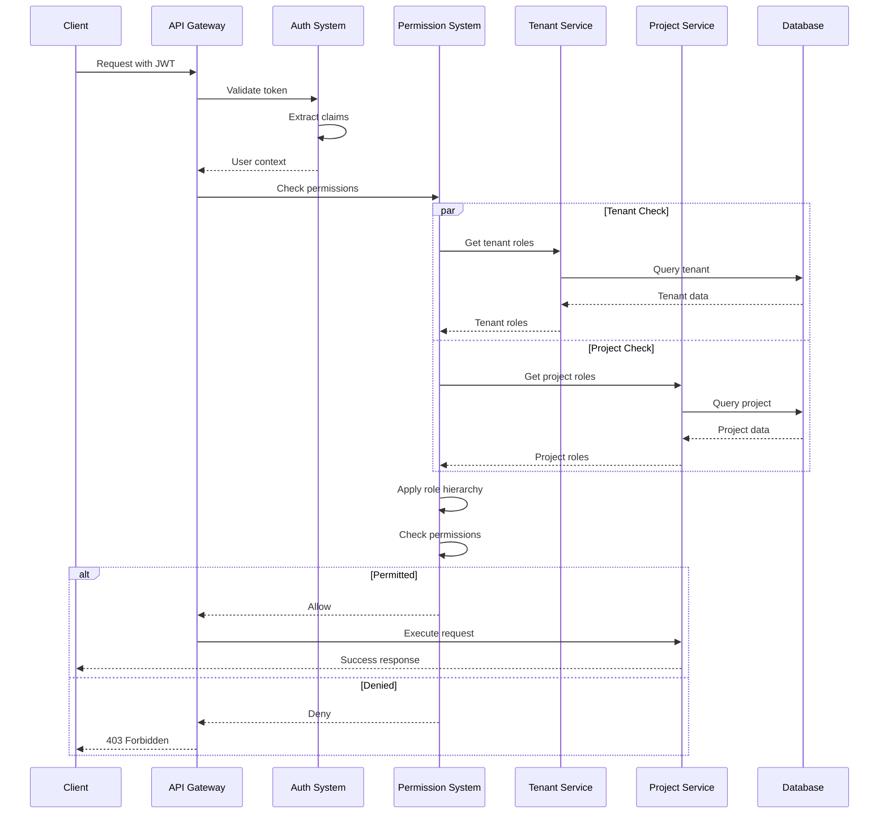

# MWAP Architecture Documentation

## Overview

MWAP (Modular Web Application Platform) is a full-stack TypeScript application built with modern technologies. It provides a foundation for building scalable web applications with authentication, cloud storage integration, and a modular architecture.

## Technology Stack

### Frontend
- **Framework**: React 18 with TypeScript
- **Build Tool**: Vite
- **UI Library**: Mantine UI v7
- **Routing**: React Router v6
- **Authentication**: Auth0 React SDK
- **State Management**: React hooks and context
- **Type Safety**: TypeScript with strict mode
- **API Integration**: Axios with retry logic

### Backend
- **Runtime**: Node.js
- **Framework**: Express.js with TypeScript
- **Database**: MongoDB with Mongoose
- **Authentication**: 
  - Auth0 for user authentication
  - OAuth for cloud storage providers
- **Security**: 
  - JWT validation
  - Rate limiting
  - CORS
  - Helmet
- **Configuration**: Environment-based with validation
- **Logging & Monitoring**:
  - Winston logger
  - Logfmt format
  - Request tracking
  - Integration state logging
  - Health monitoring
  - Memory metrics

### Infrastructure
- **Hosting**: Heroku
- **Database**: MongoDB Atlas
- **Authentication**: Auth0
- **Cloud Storage**: Multiple provider support (Google Drive, Dropbox)
- **CI/CD**: Heroku Pipeline with review apps

## Project Structure

```
mwap/
├── client/                 # Frontend application
│   ├── src/
│   │   ├── auth/          # Auth0 configuration
│   │   ├── components/    # React components
│   │   │   ├── auth/      # Authentication components
│   │   │   ├── common/    # Shared components
│   │   │   ├── invite/    # Invite management
│   │   │   ├── layout/    # Page layouts
│   │   │   ├── project/   # Project management
│   │   │   ├── tenant/    # Tenant management
│   │   │   └── user/      # User profile components
│   │   ├── core/          # Core functionality
│   │   │   ├── api/       # API client and configuration
│   │   │   ├── auth/      # OAuth flow management
│   │   │   └── errors/    # Error handling
│   │   ├── hooks/         # Custom React hooks
│   │   ├── pages/         # Page components
│   │   ├── types/         # TypeScript definitions
│   │   ├── App.tsx        # Main application
│   │   └── main.tsx       # Entry point
│   └── vite.config.ts     # Build configuration
│
├── server/                # Backend application
│   ├── src/
│   │   ├── core/         # Core functionality
│   │   │   ├── auth/     # Authentication
│   │   │   ├── config/   # Environment configuration
│   │   │   ├── errors/   # Error definitions
│   │   │   ├── logging/  # Logging infrastructure
│   │   │   ├── middleware/ # Core middleware
│   │   │   ├── routes/   # Core routes
│   │   │   ├── types/    # Core type definitions
│   │   │   ├── utils/    # Shared utilities
│   │   │   └── validation/ # Request validation
│   │   ├── features/     # Feature modules
│   │   │   ├── invites/  # Invite management
│   │   │   ├── projects/ # Project management
│   │   │   ├── superadmin/ # Admin features
│   │   │   ├── tenant/   # Tenant management
│   │   │   └── users/    # User management
│   │   ├── routes/       # API routes
│   │   └── app.ts        # Express application setup
│   └── tsconfig.json     # TypeScript config
│
├── docs/                  # Documentation
├── scripts/              # Utility scripts
└── setup-local-dev.sh   # Development setup script
```

## Key Components

### Authentication & Authorization System

#### System Overview


1. **User Authentication (Auth0)**
   - JWT validation and refresh
   - User profile management
   - Protected route components
   - Session handling

2. **Permission Management**
   - Role-based access control (RBAC)
   - Permission inheritance
   - Super admin privileges
   - Tenant-level permissions
   - Project-level permissions
   - Automatic role assignment
   - Permission checking middleware
   - Auth0 ID (`user.sub`) based permission checks
   - ID type separation (auth vs display)

3. **OAuth Integration**
   - Multiple provider support
   - Token exchange and refresh
   - State management
   - Provider-specific configuration

### Cloud Storage Integration

1. **Provider Architecture**
   - Base provider class with shared functionality
   - Provider-specific implementations
     - Google Drive provider
     - Dropbox provider
   - Factory pattern for provider instantiation
   - Interface-based design
   - Caching layer

2. **Core Features**
   - Folder listing with pagination
   - Path resolution
   - Error handling and logging
   - Type safety with TypeScript
   - Token refresh management

### Tenant Management

1. **Core Features**
   - Tenant creation and updates
   - Cloud provider integration
   - Project organization
   - Member management

2. **Cloud Integration**
   - Provider connections
   - Token management
   - Integration status
   - Folder management

### Project Management

1. **Core Features**
   - Project creation with automatic owner assignment
   - Member management with role-based access
   - Permission-based resource access
   - Project status tracking

2. **Permission System**
   - Role hierarchy (owner > admin > member)
   - Permission inheritance from tenant roles
   - Automatic owner assignment on creation
   - Fine-grained access control
   - Permission checking middleware

3. **Integration**
   - Cloud storage access with permission checks
   - Permission-aware API endpoints
   - Project status tracking
   - Audit logging

## Development Guidelines

### Code Organization

1. **Feature-First Structure**
   - Modular feature organization
   - Clear separation of concerns
   - Shared core utilities
   - Type-safe interfaces

2. **Component Design**
   - Single responsibility
   - Clear interfaces
   - Error handling
   - Comprehensive logging

### Best Practices

1. **TypeScript Usage**
   - Strict mode enabled
   - Interface segregation
   - Proper type definitions
   - Runtime type validation
   - Type guards for data validation
   - Safe type casting with validation
   - Mongoose document handling

2. **Error Handling**
   - Consistent error types
   - Error boundaries
   - User-friendly messages
   - Detailed logging
   - Field-level validation errors
   - Specific error messages
   - Validation error aggregation
   - AppError standardization

3. **Security**
   - OAuth best practices
   - Token management
   - Input validation
   - Rate limiting
   - Permission checks
   - Role validation
   - Tenant isolation
   - Audit logging

4. **Permission Management**
   - Check permissions before actions
   - Use permission constants
   - Validate tenant context
   - Handle super admin bypass
   - Log permission checks
   - Fail closed on errors
   - Clear error messages
   - Audit important changes
   - Use `getUserIdentifier` utility for ID handling
   - Consistent auth ID usage for security operations
   - Separate display IDs from security IDs

### Development Workflow

1. **Local Development**
   ```bash
   # Install dependencies and set up development environment
   ./setup-local-dev.sh

   # Frontend Development
   cd client
   npm run dev

   # Backend Development
   cd server
   npm run dev
   ```

2. **Environment Setup**
   - Copy .env.example to .env
   - Configure Auth0 credentials
   - Set up MongoDB connection
   - Configure OAuth providers

## Current Status

The application currently supports:
1. User authentication via Auth0
2. Tenant management with cloud storage integration
3. Project creation and management
4. Member invitations and role management
5. Cloud storage provider integration (Google Drive, Dropbox)
6. Folder browsing and selection

Recent improvements:
1. Enhanced TypeScript type safety
2. Improved error handling
3. Better client-side routing
4. Optimized static file serving
5. Simplified development setup

## Future Improvements

1. **Authentication**
   - Enhanced token refresh
   - MFA support
   - Session management
   - Better error messages

2. **Cloud Integration**
   - Additional providers
   - Usage analytics
   - Quota management
   - Improved caching

3. **Project Management**
   - Project templates
   - Resource sharing
   - Usage tracking
   - Archival system

4. **Technical Infrastructure**
   - Enhanced testing
   - Performance monitoring
   - Search functionality
   - API documentation

## Support and Resources

- [Auth0 Documentation](https://auth0.com/docs)
- [MongoDB Atlas Documentation](https://docs.atlas.mongodb.com/)
- [Heroku Documentation](https://devcenter.heroku.com/)
- [Mantine UI Documentation](https://mantine.dev/)