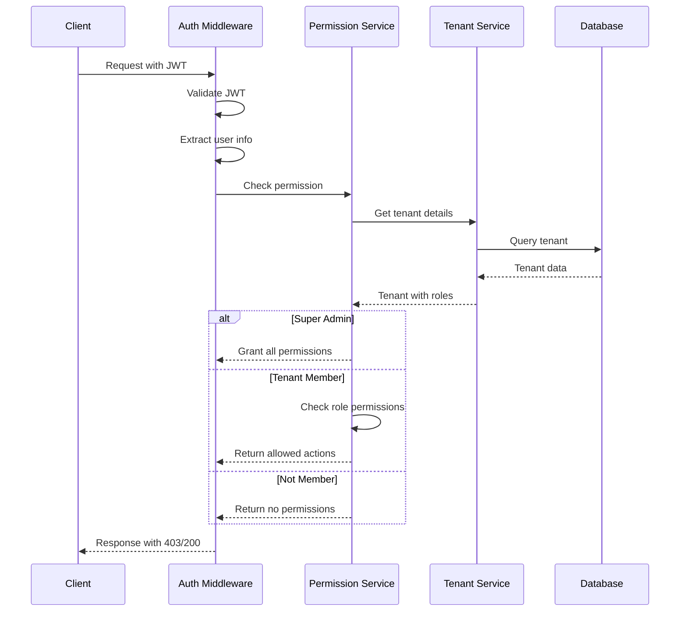
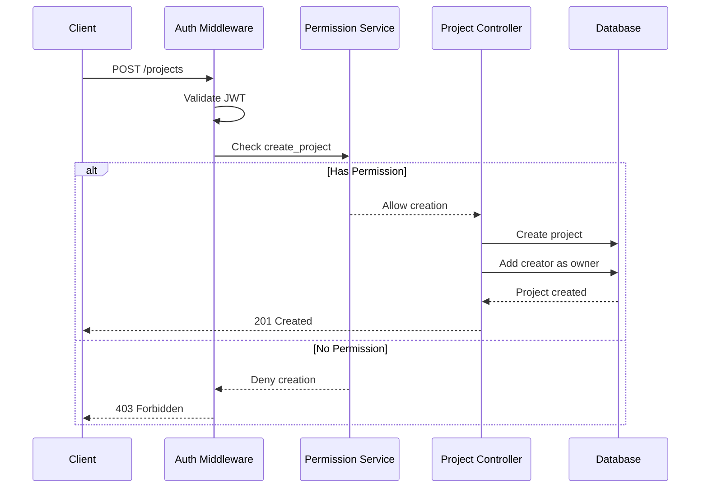
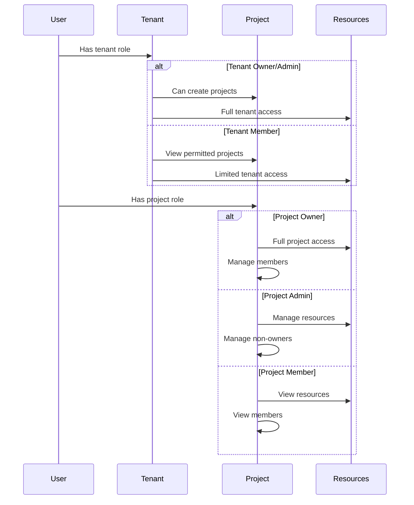

# Permission Management API Documentation

## Overview

## Sequence Diagrams

### Permission Check Flow


### Project Creation Flow


### Permission Inheritance

The permission management system provides functionality for checking and managing permissions across tenants and projects. It supports role-based access control with automatic permission inheritance and super admin privileges.

## Core Concepts

### Permission Model
Permissions are defined by:
- **Action**: The specific operation (e.g., "create_project")
- **Resource**: The target resource type (e.g., "project")
- **Context**: The tenant or project scope
- **Role**: The user's role in that context

### Role Hierarchy
1. **Super Admin**: Has all permissions across all tenants
2. **Tenant Roles**:
   - Owner: Full tenant control + project creation
   - Admin: Tenant management + project creation
   - Member: Basic tenant access
3. **Project Roles**:
   - Owner: Full project control (permanent)
   - Admin: Project management
   - Member: Basic project access

### Permission Inheritance
- Super admins inherit all permissions
- Tenant owners/admins can create projects
- Project creators become project owners
- Project permissions are independent of tenant roles

## Endpoints

### GET /api/v1/permissions
Get user permissions for a tenant.

**Authentication Required**: Yes

**Query Parameters**:
- tenantId (required): The tenant to check permissions in

**Response**:
```json
{
  "data": {
    "permissions": [
      {
        "action": "create_project",
        "resource": "project",
        "tenantId": "string",
        "allowed": true
      }
    ],
    "roles": ["owner", "admin", "member"]
  },
  "meta": {
    "requestId": "string"
  }
}
```

## Permission Actions

### Project Permissions
```typescript
export const PROJECT_PERMISSIONS = {
  CREATE: 'create_project',      // Create new projects
  READ: 'read_project',         // View project details
  UPDATE: 'update_project',     // Modify project settings
  DELETE: 'delete_project',     // Archive/delete project
  MANAGE_MEMBERS: 'manage_project_members'  // Manage project membership
};
```

## Permission Matrix

### Tenant Level

| Action | Super Admin | Owner | Admin | Member |
|--------|-------------|-------|-------|--------|
| Create Project | ✓ | ✓ | ✓ | - |
| List Projects | ✓ | ✓ | ✓ | ✓* |
| Manage Tenant | ✓ | ✓ | - | - |

\* Members can only list projects they have access to

### Project Level

| Action | Super Admin | Owner | Admin | Member |
|--------|-------------|-------|-------|--------|
| View Project | ✓ | ✓ | ✓ | ✓ |
| Update Project | ✓ | ✓ | ✓ | - |
| Delete Project | ✓ | ✓ | - | - |
| Manage Members | ✓ | ✓ | ✓ | - |

## Error Responses

### 400 Bad Request
```json
{
  "error": {
    "code": "VALIDATION_ERROR",
    "message": "tenantId is required",
    "requestId": "string"
  }
}
```

### 401 Unauthorized
```json
{
  "error": {
    "code": "AUTHENTICATION_ERROR",
    "message": "User not authenticated",
    "requestId": "string"
  }
}
```

### 403 Forbidden
```json
{
  "error": {
    "code": "AUTHORIZATION_ERROR",
    "message": "Insufficient permissions",
    "requestId": "string"
  }
}
```

## Implementation Examples

### Checking Permissions
```typescript
// Check if user can create project
const canCreate = await permissionService.checkPermission(
  user,
  PERMISSIONS.PROJECT.CREATE,
  'project',
  tenantId
);

if (!canCreate) {
  throw new AuthorizationError('Insufficient permissions');
}
```

### Getting User Permissions
```typescript
// Get all permissions for user in tenant
const { permissions, roles } = await permissionService.getUserPermissions(
  user,
  tenantId
);

// Check specific permission
const hasPermission = permissions.some(p => 
  p.action === 'create_project' && 
  p.resource === 'project' && 
  p.allowed
);
```