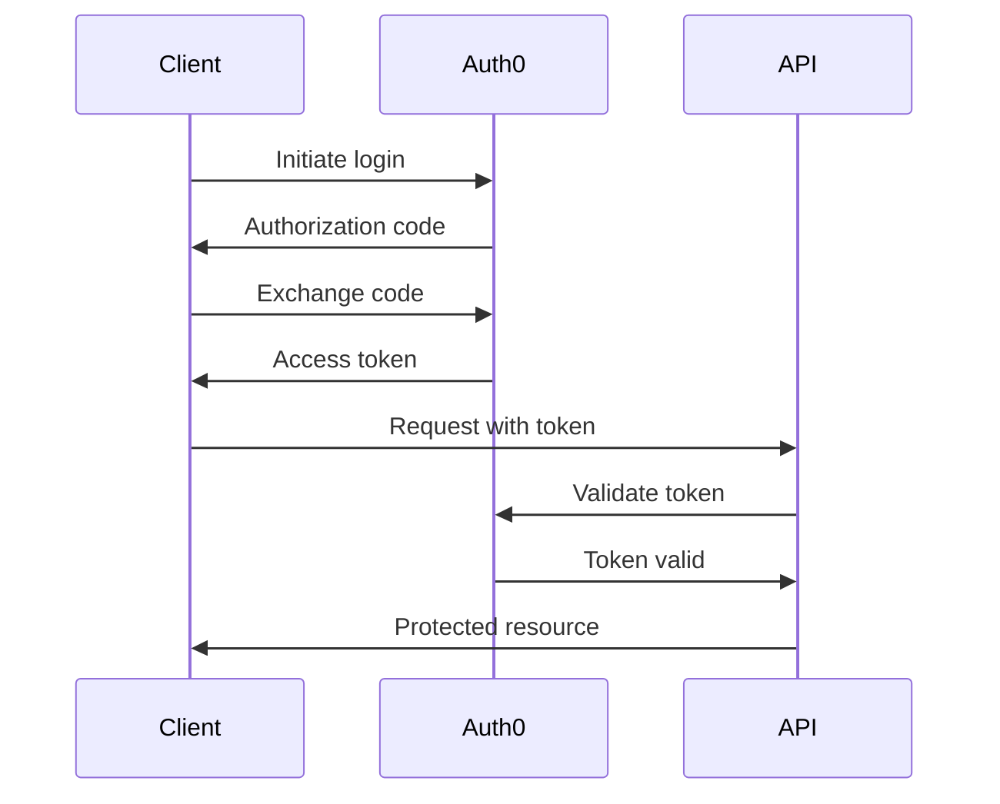
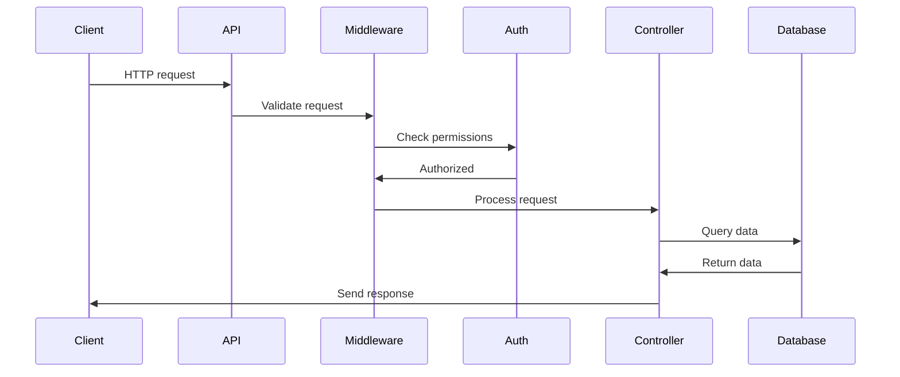

# MWAP Architecture Overview

## System Architecture

### High-Level Overview
```
┌─────────────┐     ┌─────────────┐     ┌─────────────┐
│   Client    │────▶│    API      │────▶│  Database   │
│   (React)   │     │  (Express)  │     │ (MongoDB)   │
└─────────────┘     └─────────────┘     └─────────────┘
       │                   │                   │
       │                   │                   │
       └───────────────▶ Auth0 ◀──────────────┘
```

### Key Components

1. **Frontend (React + TypeScript)**
   - React 18 with Vite
   - Mantine UI components
   - React Router v6
   - Auth0 SPA SDK
   - Type-safe API integration

2. **Backend (Node.js + Express)**
   - TypeScript implementation
   - Modular routing system
   - Middleware-based architecture
   - JWT validation
   - Rate limiting

3. **Database (MongoDB)**
   - Document-based storage
   - Mongoose ODM
   - Field-level encryption
   - Indexing strategy

4. **Authentication (Auth0)**
   - PKCE flow for SPA
   - JWT tokens
   - Role-based access
   - Secure session management

## Directory Structure

```
mwap/
├── client/                 # Frontend application
│   ├── src/
│   │   ├── assets/        # Static assets
│   │   ├── auth/          # Auth0 configuration
│   │   ├── hooks/         # Custom React hooks
│   │   ├── pages/         # Page components
│   │   ├── services/      # API services
│   │   ├── App.tsx        # Main application
│   │   └── main.tsx       # Entry point
│   └── vite.config.ts     # Build configuration
│
├── server/                # Backend application
│   ├── src/
│   │   ├── config/       # Configuration
│   │   ├── middleware/   # Express middleware
│   │   ├── routes/       # API routes
│   │   └── index.ts      # Entry point
│   └── tsconfig.json     # TypeScript config
│
└── docs/                 # Documentation
    ├── api/             # API documentation
    ├── architecture/    # Architecture docs
    └── development/     # Development guides
```

## Core Features

### Multi-Tenancy
- Tenant isolation
- Role-based access control
- Resource management
- Cross-tenant security

### Authentication & Authorization
- Auth0 integration
- JWT validation
- Role hierarchy
- Permission management

### API Design
- RESTful endpoints
- Type-safe responses
- Standard error format
- Request validation

### Security
- CORS configuration
- Rate limiting
- HTTP security headers
- Request logging

## Data Flow

1. **Authentication Flow**


2. **Request Flow**


## Security Considerations

1. **Authentication**
   - Secure token handling
   - Regular token rotation
   - Proper CORS configuration
   - XSS prevention

2. **Data Security**
   - Field-level encryption
   - Secure connections
   - Data validation
   - Input sanitization

3. **API Security**
   - Rate limiting
   - Request validation
   - Error handling
   - Audit logging

## Performance Optimization

1. **Frontend**
   - Code splitting
   - Lazy loading
   - Bundle optimization
   - Cache management

2. **Backend**
   - Connection pooling
   - Query optimization
   - Response caching
   - Compression

3. **Database**
   - Proper indexing
   - Query optimization
   - Connection management
   - Data modeling

## Monitoring & Logging

1. **Application Metrics**
   - Request timing
   - Error rates
   - Resource usage
   - User activity

2. **System Health**
   - Server metrics
   - Database performance
   - API availability
   - Authentication status

3. **Audit Trail**
   - User actions
   - System changes
   - Security events
   - Error tracking

## Deployment Strategy

1. **Environments**
   - Development
   - Staging
   - Production
   - Review apps

2. **CI/CD Pipeline**
   - Automated testing
   - Code quality checks
   - Security scanning
   - Deployment automation

3. **Infrastructure**
   - Heroku hosting
   - MongoDB Atlas
   - Auth0 services
   - CDN integration