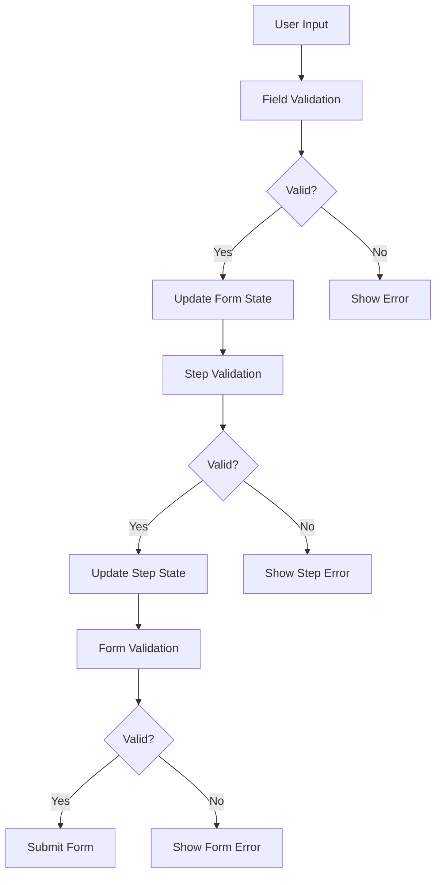
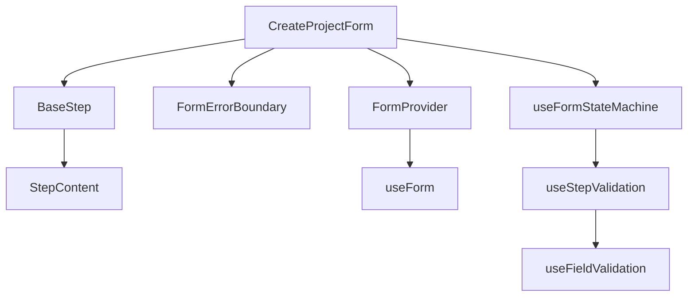

# Form Architecture

## Overview

The project creation form follows a layered architecture that separates concerns and promotes maintainability.

## Architecture Layers

```
┌─────────────────────────────────────┐
│            Components               │
│  ┌─────────────┐   ┌─────────────┐ │
│  │    Steps    │   │   Common    │ │
│  └─────────────┘   └─────────────┘ │
├─────────────────────────────────────┤
│            State Machine            │
│  ┌─────────────┐   ┌─────────────┐ │
│  │    Form     │   │    Step     │ │
│  └─────────────┘   └─────────────┘ │
├─────────────────────────────────────┤
│           Error Handling            │
│  ┌─────────────┐   ┌─────────────┐ │
│  │ Boundaries  │   │  Handlers   │ │
│  └─────────────┘   └─────────────┘ │
├─────────────────────────────────────┤
│            Validation              │
│  ┌─────────────┐   ┌─────────────┐ │
│  │   Rules     │   │   Types     │ │
│  └─────────────┘   └─────────────┘ │
└─────────────────────────────────────┘
```

## Component Structure

```typescript
// Component hierarchy
<CreateProjectForm>
  <FormProvider>
    <FormErrorBoundary>
      <BaseStep>
        <StepContent />
      </BaseStep>
    </FormErrorBoundary>
  </FormProvider>
</CreateProjectForm>
```

## State Management

The form uses a combination of local and global state:

1. **Form State** (Mantine Form)
   - Field values
   - Validation state
   - Touch state

2. **Step State** (State Machine)
   - Current step
   - Step validation
   - Step completion

3. **Error State** (Error Boundaries)
   - Error messages
   - Error recovery
   - Error logging

## Data Flow



## Module Organization

```
src/
├── components/
│   ├── tenant/
│   │   ├── CreateProjectForm.tsx
│   │   └── steps/
│   │       ├── ProviderStep.tsx
│   │       ├── NameStep.tsx
│   │       └── FolderStep.tsx
│   └── common/
│       ├── BaseStep.tsx
│       └── ErrorBoundary.tsx
├── hooks/
│   ├── useFormStateMachine.ts
│   ├── useStepValidation.ts
│   └── useFieldValidation.ts
├── types/
│   ├── form.ts
│   └── validation.ts
└── utils/
    ├── validation.ts
    └── errors.ts
```

## Dependencies



## Error Handling

The error handling system follows a hierarchical approach:

1. **Field Level**
   - Validation errors
   - Format errors
   - Type errors

2. **Step Level**
   - Step validation
   - Step transitions
   - Step cleanup

3. **Form Level**
   - Form validation
   - Submission errors
   - API errors

## Validation System

The validation system is organized in layers:

1. **Field Validation**
   - Type checking
   - Format validation
   - Required fields

2. **Step Validation**
   - Field dependencies
   - Business rules
   - Async validation

3. **Form Validation**
   - Cross-field validation
   - API validation
   - Final validation

## Best Practices

1. **Component Design**
   - Keep components focused
   - Use composition
   - Handle errors properly

2. **State Management**
   - Single source of truth
   - Predictable updates
   - Clear state transitions

3. **Error Handling**
   - Proper error boundaries
   - Clear error messages
   - Recovery options

4. **Validation**
   - Type safety
   - Clear feedback
   - Proper async handling

## Performance Considerations

1. **State Updates**
   - Batch updates
   - Memoize callbacks
   - Optimize rerenders

2. **Validation**
   - Debounce validation
   - Cache results
   - Async validation

3. **Error Handling**
   - Proper error boundaries
   - Error recovery
   - Error logging

## Security

1. **Input Validation**
   - Sanitize inputs
   - Validate types
   - Handle edge cases

2. **API Security**
   - Validate tokens
   - Handle timeouts
   - Secure data

3. **Error Messages**
   - Safe error messages
   - No sensitive data
   - Proper logging

## Testing Strategy

1. **Unit Tests**
   - Component tests
   - Hook tests
   - Utility tests

2. **Integration Tests**
   - Form flow
   - Error handling
   - State management

3. **End-to-End Tests**
   - User flows
   - Error scenarios
   - Edge cases