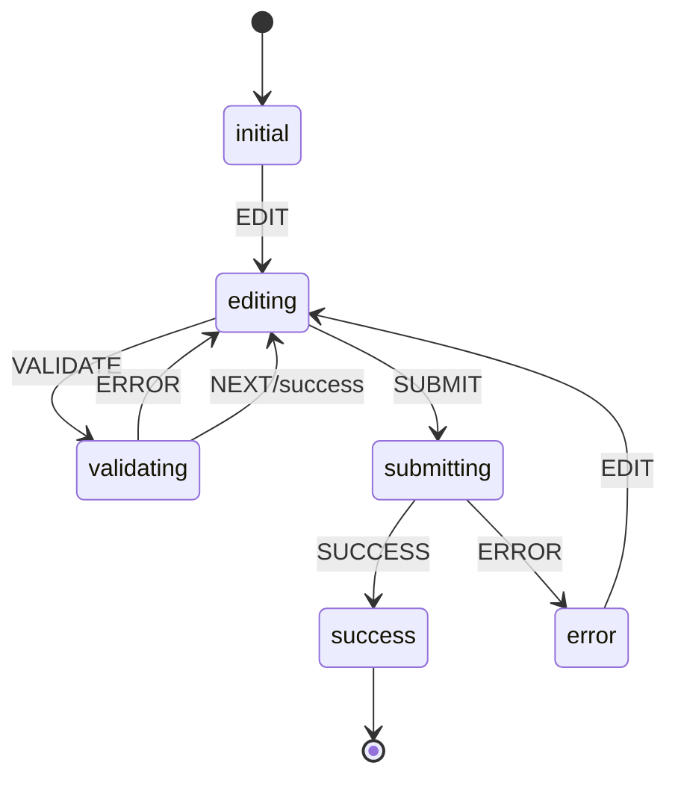

# Form State Machine

## Overview

The form state machine manages the form's state transitions and validation flow. It's implemented using the `useFormStateMachine` hook.

## States

```typescript
type FormState =
  | 'initial'     // Form just mounted
  | 'editing'     // User is editing current step
  | 'validating'  // Validating current step
  | 'submitting'  // Form is being submitted
  | 'error'       // Error state
  | 'success';    // Form submitted successfully
```

## Events

```typescript
type FormEvent =
  | 'EDIT'        // User starts editing
  | 'VALIDATE'    // Validate current step
  | 'NEXT'        // Move to next step
  | 'PREV'        // Move to previous step
  | 'SUBMIT'      // Submit form
  | 'ERROR'       // Error occurred
  | 'RESET'       // Reset form
  | 'SUCCESS';    // Form submitted successfully
```

## Usage

```typescript
import { useFormStateMachine } from '@/hooks/useFormStateMachine';

function CreateProjectForm() {
  const {
    state,
    activeStep,
    validatedSteps,
    isStepValid,
    canNavigateToStep,
    handleNext,
    handlePrev,
    handleSubmit,
    handleReset
  } = useFormStateMachine({
    form,
    config: {
      steps: [
        {
          validate: validateProviderStep,
          requiredFields: ['cloudProvider']
        },
        // ... more steps
      ],
      onSubmit: handleFormSubmit
    }
  });

  // ... rest of component
}
```

## State Transitions



## Validation Flow

1. User edits form fields
2. Field-level validation runs
3. Step validation on next/submit
4. Form-level validation on submit
5. API validation during submission

## Error Recovery

The state machine provides error recovery through:

1. State rollback on validation errors
2. Form reset capability
3. Step navigation restrictions
4. Validation state persistence

## Best Practices

1. **State Management**
   - Keep state transitions predictable
   - Validate before state changes
   - Handle cleanup properly

2. **Error Handling**
   - Catch and handle all errors
   - Provide recovery options
   - Maintain consistent state

3. **Validation**
   - Validate at appropriate levels
   - Provide clear feedback
   - Enable async validation

4. **Performance**
   - Debounce validation
   - Cache validation results
   - Clean up resources

## Example

```typescript
// Configuration
const config: FormStateMachineConfig = {
  steps: [
    {
      validate: (values) => {
        if (!values.cloudProvider) {
          return 'Cloud provider is required';
        }
        return null;
      },
      requiredFields: ['cloudProvider']
    }
  ],
  onSubmit: async (values) => {
    await api.createProject(values);
  }
};

// Usage
function ProjectForm() {
  const form = useForm({
    initialValues: {
      cloudProvider: '',
      name: '',
      folder: ''
    }
  });

  const machine = useFormStateMachine({ form, config });

  return (
    <FormProvider form={form}>
      <form onSubmit={machine.handleSubmit}>
        {/* Form content */}
      </form>
    </FormProvider>
  );
}
```