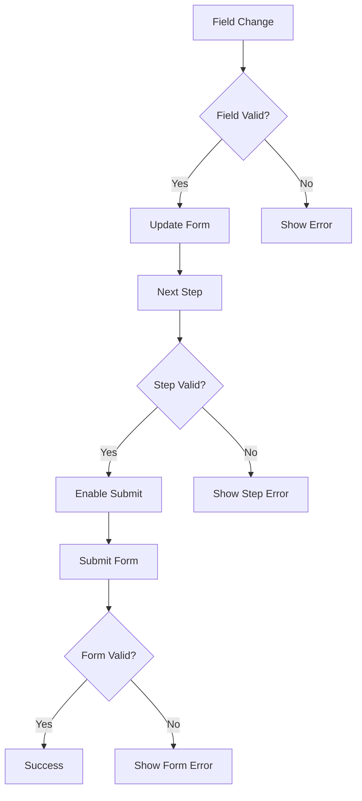

# Form Validation System

## Overview

The form validation system provides a comprehensive approach to validating form data at multiple levels: field, step, and form. It uses TypeScript for type safety and supports both synchronous and asynchronous validation.

## Validation Types

```typescript
// Validation rule type
interface ValidationRule<T = any> {
  validate: (value: T) => string | null;
  message?: string;
}

// Validation rules for a field
interface ValidationRules {
  [field: string]: ValidationRule[];
}

// Form error type
interface FormError {
  field: string;
  message: string;
}

// Validation result
interface ValidationResult {
  isValid: boolean;
  errors: FormError[];
}
```

## Field Validation

```typescript
// Field validation rules
const fieldRules: ValidationRules = {
  cloudProvider: [
    {
      validate: (value) => !value ? 'Cloud provider is required' : null,
      message: 'Please select a cloud provider'
    }
  ],
  name: [
    {
      validate: (value) => !value ? 'Name is required' : null
    },
    {
      validate: (value) => !/^[a-zA-Z0-9-]+$/.test(value) 
        ? 'Name can only contain letters, numbers, and hyphens' 
        : null
    }
  ]
};

// Field validation hook
function useFieldValidation(rules: ValidationRules) {
  const validateField = useCallback((field: string, value: any) => {
    const fieldRules = rules[field] || [];
    for (const rule of fieldRules) {
      const error = rule.validate(value);
      if (error) {
        return createFormError(field, rule.message || error);
      }
    }
    return null;
  }, [rules]);

  return { validateField };
}
```

## Step Validation

```typescript
// Step validation configuration
interface StepValidation {
  validate: (values: FormValues) => string | null;
  requiredFields: Array<keyof FormValues>;
}

// Step validation hook
function useStepValidation(config: StepValidation) {
  const validateStep = useCallback(async (values: FormValues) => {
    // Validate required fields
    for (const field of config.requiredFields) {
      const error = validateField(field, values[field]);
      if (error) return error;
    }

    // Run step-specific validation
    const error = await config.validate(values);
    return error ? createFormError('step', error) : null;
  }, [config, validateField]);

  return { validateStep };
}
```

## Form Validation

```typescript
// Form validation configuration
interface FormValidation {
  steps: StepValidation[];
  onSubmit: (values: FormValues) => Promise<void>;
}

// Form validation hook
function useFormValidation(config: FormValidation) {
  const validateForm = useCallback(async (values: FormValues) => {
    // Validate all steps
    for (const step of config.steps) {
      const error = await validateStep(step, values);
      if (error) return error;
    }

    // Run form-level validation
    try {
      await config.onSubmit(values);
      return null;
    } catch (error) {
      return handleValidationError(error);
    }
  }, [config]);

  return { validateForm };
}
```

## Usage

### In Components

```typescript
function FormStep({ form, rules }) {
  const { validateField } = useFieldValidation(rules);

  return (
    <BaseStep>
      <TextInput
        {...form.getInputProps('name')}
        onBlur={() => validateField('name', form.values.name)}
      />
    </BaseStep>
  );
}
```

### In Form Configuration

```typescript
const formConfig: FormValidation = {
  steps: [
    {
      validate: validateProviderStep,
      requiredFields: ['cloudProvider']
    },
    {
      validate: validateNameStep,
      requiredFields: ['name', 'description']
    }
  ],
  onSubmit: submitForm
};
```

## Best Practices

1. **Field Validation**
   - Validate on blur/change
   - Provide immediate feedback
   - Use clear error messages

2. **Step Validation**
   - Validate required fields first
   - Run step-specific validation
   - Handle async validation

3. **Form Validation**
   - Validate all steps
   - Handle submission errors
   - Provide recovery options

4. **Error Handling**
   - Use proper error types
   - Handle async errors
   - Enable error recovery

## Validation Flow



## Examples

### Field Validation

```typescript
const nameRules: ValidationRule[] = [
  {
    validate: (value: string) => {
      if (!value) return 'Name is required';
      if (value.length < 3) return 'Name must be at least 3 characters';
      if (!/^[a-zA-Z0-9-]+$/.test(value)) {
        return 'Name can only contain letters, numbers, and hyphens';
      }
      return null;
    }
  }
];
```

### Step Validation

```typescript
const validateProviderStep: StepValidation = {
  validate: async (values) => {
    if (!values.cloudProvider) {
      return 'Please select a cloud provider';
    }
    
    try {
      await validateProvider(values.cloudProvider);
      return null;
    } catch (error) {
      return 'Invalid cloud provider';
    }
  },
  requiredFields: ['cloudProvider']
};
```

### Form Validation

```typescript
const validateForm = async (values: FormValues) => {
  // Validate all steps
  for (let i = 0; i < steps.length; i++) {
    if (!isStepValid(i)) {
      throw new ValidationError('Please complete all steps');
    }
  }

  // Submit form
  try {
    await submitForm(values);
  } catch (error) {
    handleError(error);
    throw error;
  }
};
```