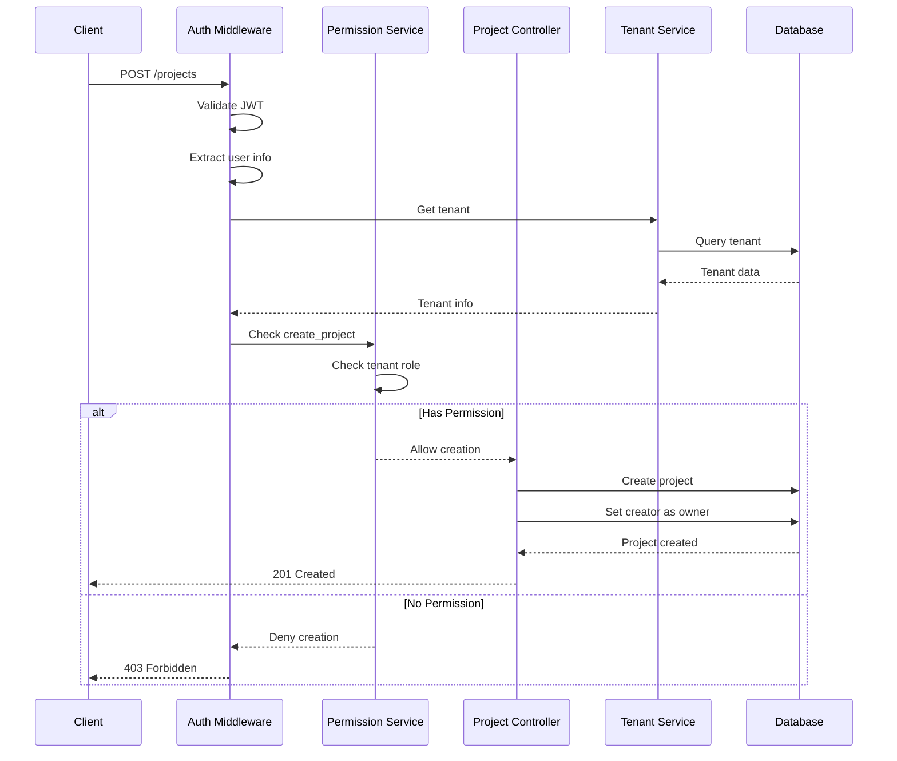
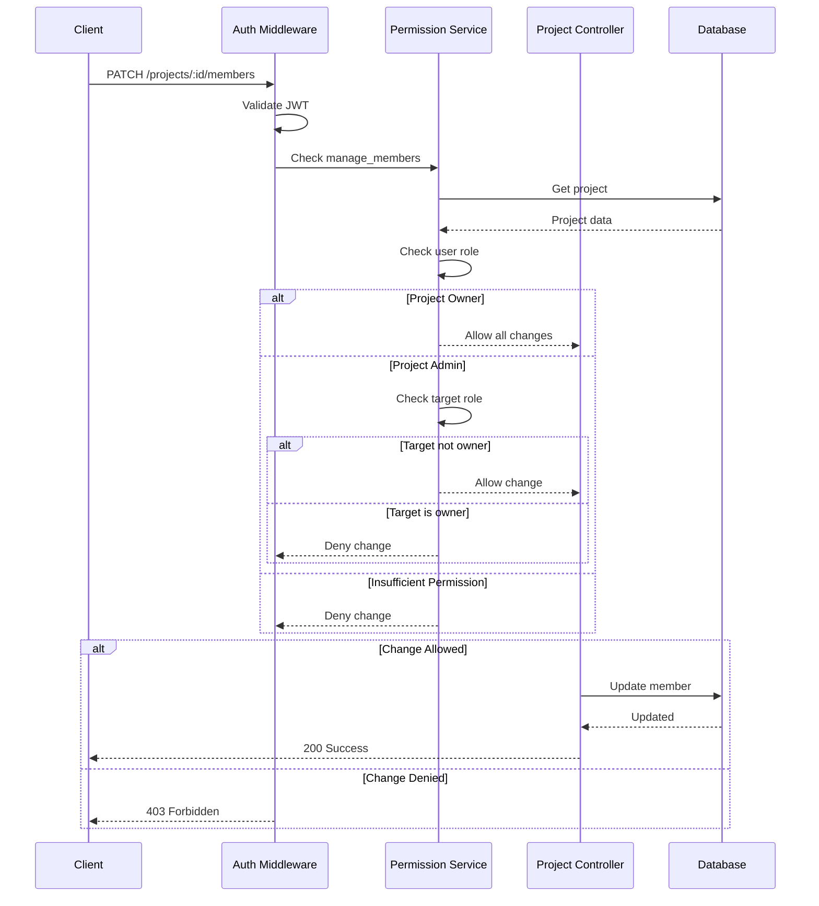
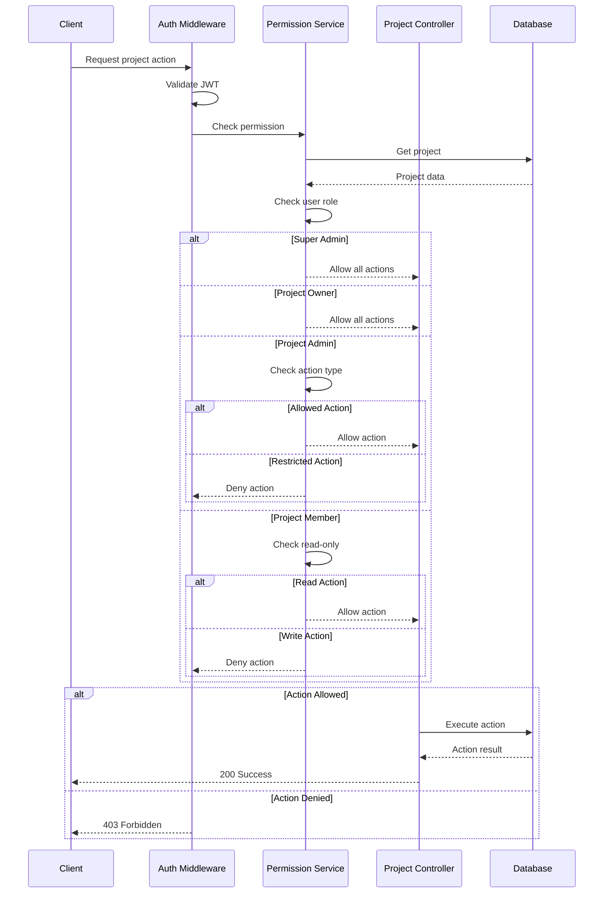

# Project Management API Documentation

## Overview
The project management system provides functionality for creating and managing projects within a tenant, with role-based access control.

## Sequence Diagrams

### Project Creation with Permissions


### Project Member Management


### Project Access Control


## Endpoints

### GET /api/v1/projects
List all accessible projects.

**Authentication Required**: Yes

**Query Parameters**:
- page (optional): Page number
- limit (optional): Items per page
- sort (optional): Sort field
- order (optional): 'asc' or 'desc'
- archived (optional): Include archived projects

**Response**:
```json
{
  "data": [{
    "id": "string",
    "name": "string",
    "description": "string",
    "tenantId": "string",
    "createdBy": "string",
    "createdAt": "string",
    "updatedAt": "string",
    "archived": boolean
  }],
  "meta": {
    "requestId": "string",
    "pagination": {
      "page": number,
      "limit": number,
      "total": number
    }
  }
}
```

### POST /api/v1/projects
Create a new project. The creator automatically becomes the project owner.

**Authentication Required**: Yes
**Permission Required**: `create_project` in tenant

**Request Body**:
```json
{
  "name": "string",
  "description": "string",
  "tenantId": "string"
}
```

**Response**:
```json
{
  "data": {
    "id": "string",
    "name": "string",
    "tenantId": "string",
    "role": "owner",
    "createdAt": "string"
  },
  "meta": {
    "requestId": "string"
  }
}
```

**Notes**:
- Project creator automatically gets owner role
- Owner role is permanent and cannot be changed
- Requires `create_project` permission in the tenant
- Only tenant owners/admins can create projects by default

### GET /api/v1/projects/:id
Get project details.

**Authentication Required**: Yes

**Response**: Same as project object in GET /api/v1/projects

### PATCH /api/v1/projects/:id
Update project details.

**Authentication Required**: Yes (Project Owner)

**Request Body**:
```json
{
  "name": "string",
  "description": "string",
  "archived": boolean
}
```

**Response**: Same as project object in GET /api/v1/projects

### DELETE /api/v1/projects/:id
Delete project.

**Authentication Required**: Yes (Project Owner)

**Response**:
```json
{
  "data": {
    "success": true
  },
  "meta": {
    "requestId": "string"
  }
}
```

## Member Management

### GET /api/v1/projects/:id/members
List project members.

**Authentication Required**: Yes

**Query Parameters**:
- page (optional): Page number
- limit (optional): Items per page
- sort (optional): Sort field
- order (optional): 'asc' or 'desc'

**Response**:
```json
{
  "data": [{
    "userId": "string",
    "role": "string",
    "joinedAt": "string"
  }],
  "meta": {
    "requestId": "string",
    "pagination": {
      "page": number,
      "limit": number,
      "total": number
    }
  }
}
```

### PATCH /api/v1/projects/:id/members/:userId
Update member role.

**Authentication Required**: Yes (Project Owner or Deputy*)

**Request Body**:
```json
{
  "role": "string"
}
```

\* Deputies cannot modify Owner roles

**Response**: Same as member object in GET /api/v1/projects/:id/members

### DELETE /api/v1/projects/:id/members/:userId
Remove member from project.

**Authentication Required**: Yes (Project Owner or Deputy*)

**Response**:
```json
{
  "data": {
    "success": true
  },
  "meta": {
    "requestId": "string"
  }
}
```

\* Deputies cannot remove Owners

## Role-Based Access Control

### Project Roles
```typescript
export enum ProjectRole {
  OWNER = 'owner',    // Highest permission level
  DEPUTY = 'deputy',  // Middle tier
  MEMBER = 'member'   // Base level
}
```

### Permission Matrix

| Action | Owner | Deputy | Member |
|--------|-------|--------|--------|
| View Project | ✓ | ✓ | ✓ |
| Update Project | ✓ | - | - |
| Delete Project | ✓ | - | - |
| View Members | ✓ | ✓ | ✓ |
| Add Members | ✓ | ✓ | - |
| Update Members | ✓ | ✓* | - |
| Remove Members | ✓ | ✓* | - |

\* Deputies cannot modify Owner roles

### Role Hierarchy
```typescript
export const PROJECT_ROLE_HIERARCHY = {
  [ProjectRole.OWNER]: 3,   // Highest level
  [ProjectRole.DEPUTY]: 2,  // Middle tier
  [ProjectRole.MEMBER]: 1   // Base level
};
```

## Error Responses

### 400 Bad Request
```json
{
  "error": {
    "code": "VALIDATION_ERROR",
    "message": "Invalid request parameters",
    "requestId": "string",
    "data": [{
      "field": "string",
      "message": "string"
    }]
  }
}
```

### 403 Forbidden
```json
{
  "error": {
    "code": "AUTHORIZATION_ERROR",
    "message": "Insufficient permissions",
    "requestId": "string"
  }
}
```

### 404 Not Found
```json
{
  "error": {
    "code": "NOT_FOUND_ERROR",
    "message": "Project not found",
    "requestId": "string"
  }
}
```